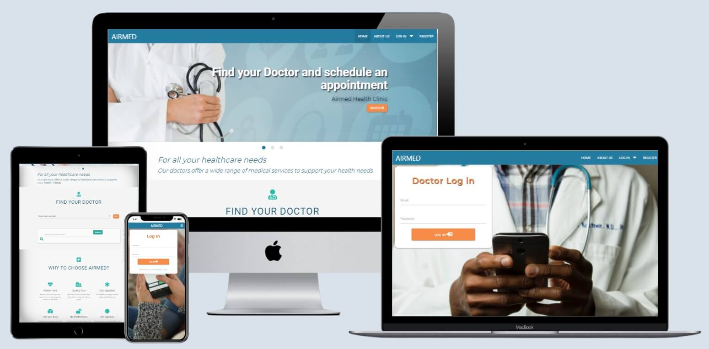

# AIRMED - doctor appointment application

*Developed and designed as part of Milestone Project 3: Python and Data Centric Development*

[Please view the live project here](#)

<h2 align="center"></h2>

Mockup responsive image was created with [Techsini](http://techsini.com/multi-mockup/index.php).

## Table of Contents

<details>

  <summary>Click to expand table of contents</summary>

1. [Overview](#overview)
2. [User Experience UX](#user-experience-ux)
    - [User Stories](#user-stories)
        - [Visitor Stories](#visitor-stories)
    - [Strategy](#strategy)
    - [Scope](#scope)
    - [Structure](#structure)
    - [Skeleton](#skeleton)
    - [Design](#design)
    - [Color Scheme](#color-scheme)
    - [Fonts](#fonts)
    - [Imagery](#imagery)
    - [Logo](#logo)
    - [Icons](#icons)
3. [Features](#features)
    - [Existing Features](#existing-features)
    - [Future Implementation](#future-implementation)
4. [User Types and permissions](#user-types-and-permissions)
5. [CRUD - Create, Read, Update and Delete](#crud-create-read-update-and-delete)
6. [Database](#database)
7. [Technologies](#technologies)
8. [Testing](#testing)
9. [Deployment](#deployment)
    - [GitHub pages](#github-pages)
    - [Forking the Repository](#forking-the-repository)
    - [Local Deployment](#local-deployment)
10. [Credits](#credits)
    - [Code](#code)
    - [Media](#media)
    - [Content](#content)
11. [Acknowledgements](#acknowledgements)
12. [Disclaimer](#disclaimer)

</details>

# Overview

The project was created as a **Milestone Project 3** as a part of **Diploma in Full Stack Software Development** with **Code Institute**. The project is developed using Python, JavaScript, HTML, CSS, and Materialize framework.

AIRMED is a healthcare application that contains information about AIRMED, a fictional clinic, its doctors, services, and patient data. Its main purpose is to give a real-time access to high-quality, affordable healthcare to all. In Irish mythology, Airmed was the goddess of healing and this name seemed appropriate for the application name.

Users will be able to make appointments quickly, while doctors are not involved in the appointment process, so their time will also be saved. All the information from AIRMED, patient personal data, doctor data is saved in one place, easily accessible from any digital device, 24/7.

Well-done UI is one of the key factors defining the success of AIRMED healthcare application. The application is easy to use and simple to navigate. Also, the User Interface is engaging, attractive and professional. It is taken in consideration that the patient and doctor's user data should be safe and secure to access.

**Please note, this project is for educational purposes only and provided clinic's and doctor's information is fictional.**

# User Experience (UX)

## User Stories

### Visitor Stories

1. As a site visitor, I would like to gain an understanding of the website's purpose from the home page.
2. As a site visitor, I would like to easily navigate through the site on all devices and find what I am looking for with an ease.
3. As a site visitor, I would like to see clinic's location and address on the map.

### Patient Stories

1. As a patient, I would like to have an option to register on the site and to create my personal account.
2. As a patient, I want a webiste that looks professional so I feel confident in storing my personal data.
3. As a patient, I want to be able to update my personal data.
4. As a patient, I want to have an option to search for doctors by the name or specialty.
5. As a patient, I want to have an option to make an appointment with a medical professional.

### Doctor Stories

1. As a doctor, I want to be able to see my personal data.
2. As a doctor, I want to be able to update my personal data.
3. As a doctor, I want to have an option to uploade profile image.

### Administrator Stories

1. As an admin, I would like to have an option to add new doctor and his/her personal data on the system.
2. As an admin, I want to be able to delete doctor profile to ensure it adheres to site conditions.
3. As an admin, I would like to have an option to search for doctors by the name or specialty.

## Strategy
### Project Goals
- The main function of the application is to make the app accessible for each and every potential user who is a potential patient
- AIRMED will be created with a primary purpose to solve patient problems, beginning with an online appointment booking
- Attractive and good quality UI design
- To enable an easy access to the heatlh clinic, services, and doctor's information

## Scope

The site will be fully responsive mobile first website. Many features will be available that allow the user to engage and find needed information fast and easy.

The site consists of a homepage which gives an overview of the site purpose with search feature, specialties information and why to choose AIRMED Healtg clinic. Second page is About Us page which tells more about the Clinic, its mission and values, and location.

The website furthermore contains a Login In pages for Patients and Doctors respectively. Since the website will hold lots of data, the site owner wanted to deferentiet two separate points for login. The website will have a Register page for patients and a register page for Doctors which is named Add Doctor. Doctor registration will be performed only by Admin users.

Both Patients and Doctors will have Profile pages where they will be able to update some of the personal information. These pages are only visible when the user will be logged in under their username / email address respectively. Admin users will be able to see all Doctor profiles under the Dashboard page where they will have ability to search for and delete a particular doctor profile.

## Structure

The website will be designed to be pleasing to the eye, consistent and user friendly.
- Interaction Design
    - Consistent design will be used throughout the website to maintain a good UX.
    - The navigation with effective slider background images will make the website look elegant and attractive.
    - Easy and fast patient log in and register forms 

- Information Architecture (IA)
    - The project was conceptualized as a websige divided in four pages. This structure was used because it is simple and familiar to the site visitors and it is sufficient for all user stories.
    - Short paragraphs providing the relevant information will be used. This approach was selected to provide enough information, yet not to overwhelm.
    - The content is organized and categorized by importance from top to bottom and left to right
    - Personal user profiles for doctors and patients

## Skeleton
The wireframes were created in [Balsamiq](https://balsamiq.com/).

TO BE ADDED 

## Design
### Color Scheme

Delicate and soothing color palette will be chosen for medical app. Users should feel calm and comforted when opening AIRMED app, knowing that they have come to the right place to address their healthcare needs, questions, and any concerns.

- Celadon Blue (#247BA0)
- Blue Sapphire(#16546E)
- Green Sheen (#70C1B3)
- Middle Blue Green (#91CEB9)
- Mango Tango (#f68c48)
- White (#FFFFFF)

<h2 align="center"></h2>

[Coolors](https://coolors.co/) was used to create a color palette.

Mainly cold colors will be selected throughout the app in order to establish an overall sense of tranquility that is necessary to help users concentrate on the more important app features.

White will be primarily used as the background because it represents reverence, purity, and innocence. This association calms people and influences their brain activity in a very positive way. Blue color symbolizes a sense of calm, peace harmony, trust and knowledge. Celadon Blue will be used to promote a tranquil environment for the users. Green is  associated with health, good luck, youth, vigor, generosity, and fertility. A variaty of orange color (Mango Tango) will be used sparingly as button highlighters.

### Fonts

- Two fonts will be used throughout the project, **Roboto** and **Montserrat**. Both will be used with ``sans-serif`` font as a fallback.
**Montserrat** will be used for the main headings and **Roboto** will be used for the hero text, paragraph sections and the footer.

- These fonts pair very well together and make the website appear both prestigious and contemporary. They make a good combination of tradition and modernity.

- Fonts were imported from [Google Fonts](https://fonts.google.com/).

### Imagery

### Logo

- I used [Canva](https://www.canva.com/) to design the custom logo which was used only for favicon.

### Icons

Icons should be obvious and very intuitive so that users can easily understand what a particular icon represents. Also, a detailed heading will be used for each icon to describe top specialties the Airmed clinic offers. 

# Features

AIRMED doctor application will be built to be fully responsive mobile-first. This will be primarily achieved by utilizing the Materialize's grid system.

## Existing Features

- Navigation menu
    - responsive on all devices
    - hamgurger menu on smaller devices
- Responsiveness
    - by using the mobile-first approach, the website will be built to be fully responsive
- Slider (carousel)
    - a slider with an effective hero background images will be used to gain instant user attention
    - a hero text strategically placed in transparent text box
- Interactive
    - back to top arrow button will appear on the lower right of the page when the user starts to scroll down the page
    - animate on scroll library (AOS)
    - parallax feature
- Social media
    - social media icons will be located at the footer
    - allow users to find more information on national parks on the social media
- Registration and Log in option for patients
- Log in option for doctors
- Patients and doctors will have separate form to log in
- Personal profile for patients and doctors
- Appointment request form
    - visitors and patients 
- Search feature
    - visitors and patients will have ability to search for doctors by the doctor's name or specialties
    - after the search users will have an option to make an appointment request
    - admin users will have an option to search for doctors by the doctor's name or specialties
- Create / Manage / Add / Edit / Delete profiles
    - patients will have an ability to create, update and delete their profiles
    - doctor users will have an ability to update their profiles
    - admin users will have an ability to update their profiel and to create and delete doctor's profiles
- 404 and 500 error pages
    - if a user navigates to a page which does not exist or if they do not have permission to access, they will be directed to a 404 error page
    - if there are an internal problems with the server, a 500 error page will appear

## Future Implementation

- Ratings & Reviews for doctors
- Appointment approval and rejection available on the app 
- Pagination
- Forgot password feature
- Real time chat
- Video consultation
- Payment integration
- Smart scheduling
- Subscription packages

# User Types and permissions
There are four types of users that this website is designed for:

## Visitor

A visitor is anyone who navigates to this website and can navigate through the homepage and about page. Visitors can search for and view through the list of available doctors and make an appointment request. Furthermore, visitors can register for an account. The website is a full functional for read only access for visitors.

## Patient

A visitor who registers for an account automatically becomes a "patient". Patients will have the same rights as visitors, in additon they have an access to patient profile where they can update and add additional personal data. 

## Doctor

Doctors will have the same rights as visitors and in addition they have an access to Doctor profile where they can update and add additional personal data like profile image. Doctors don't have an option to register profile by themselves. This can be done only by Admin user.

## Administrator

Administrators can register Doctor accounts and add all relevant personal data. Furthermore, admin users have an option to delete doctor profiles. They have an option to update and delete their user themselves also. This will be removed in the next version due to the security reasons.

### Access permission

There are different permission levels what each user has access to on the webpage. 

| Navbar | Visitor | Patient | Doctor | Admin |
 --- | --- | --- | --- | ---
Home| &#9989; | &#9989; | &#9989; | &#10060;
About Us |&#9989; | &#9989; | &#9989; | &#10060;
Log In|&#9989; | &#9989; | &#9989; | &#9989;
Register| &#9989; | &#10060; | &#10060; | &#10060;
Profile | &#10060; | &#9989; | &#10060; | &#10060;
Doc Profile | &#10060; | &#10060; | &#9989; | &#10060;
Add Doctor| &#10060; | &#10060; | &#10060; | &#9989;
Dashboard| &#10060; | &#10060; | &#10060; | &#9989;
Log out| &#10060; | &#9989; | &#9989; | &#9989;

# CRUD - Create, Read, Update and Delete

As part of the milestone project, we have to demonstrate that our application can perform CRUD operations.

|   	    |  Create 	|  Read 	| Update  	| Delete  	|
|---	    |---	    |---	    |---	    |---	    |
| Visitor  	| No  	    | Yes  	    | No  	    | No  	    |
| Patient	| Yes  	    | Yes 	    | Yes  	    | Yes 	    |
| Doctor	| No 	    | Yes  	    | Yes  	    | No  	    |
| Admin  	| Yes 	    | Yes  	    | Yes  	    | Yes 	    |

All CRUD functionality is present in the application; however, CRUD operations are restricted to some user types as explained in the table above.

## Technologies
## Languages

- [HTML5](https://en.wikipedia.org/wiki/HTML5) was used to complete the structure of the website.
- [CSS3](https://en.wikipedia.org/wiki/CSS) was used to style the website.
- [Python](https://www.python.org/) was used was used for the backend of the website.
- [JavaScript](https://en.wikipedia.org/wiki/JavaScript) was used to make webpage interactive.

## Frameworks, Libraries and Programs

- [Materialize](https://materializecss.com/getting-started.html) was used to aid in responsive, mobile-first website design.I used Materialize to create grid layouts, navbar, cards, forms, buttons and other features.
- [MongoDB](https://www.mongodb.com/) was used for the backend database.
- [Git](https://git-scm.com/) was used for version control.
- [GitHub](https://github.com/) was used to store the project repository and deploy the site via GitHub pages.
- [Jinja](https://jinja.palletsprojects.com/en/2.11.x/) was used to generate HTML from site templates.
- [PyMongo](https://pypi.org/project/pymongo/) contains tools for interacting with MongoDB database from Python.
- [jQuery](https://jquery.com/) was used to simplify DOM manipulation.
- [Balsamiq](https://balsamiq.com/) was used to create the wireframes for the website.
- [Font Awesome](https://fontawesome.com/) icons were used throughout the website for better user experience.
- [Google Fonts](https://fonts.google.com/) was used to import the fonts to the website.
- [Favicon](https://favicon.io/favicon-converter/) was used to create the favicon for the website.
- [CSS Tricks](https://css-tricks.com/) was used as a general source.
- [W3School](https://www.w3schools.com/) was used as a general source.
- [Stackoverflow](https://stackoverflow.com/) was used as a general source.
- [GitHub](https://github.com/) was used for repository hosting and for storing the source code.
- [Gitpod](https://gitpod.io/) was used as the development environment for writing the code.
- [Git](https://git-scm.com/) was used as version control system to add, commit and push code to GitHub.
- [Adobe Photoshop Express](https://photoshop.adobe.com/) was used for resizing and cropping the images used on the website.
- [TinyJPG](https://tinyjpg.com/) was used for compressing images while preserving transparency.
- [Techsini](http://techsini.com/multi-mockup/index.php) was used to create the responsive mockup image.
- [Paint 3D](https://www.microsoft.com/en-us/p/paint-3d/9nblggh5fv99?activetab=pivot:overviewtab) was used to modifiy couple of images.
- [Coolors](https://coolors.co/) was used for colour palette used on the website.
- [CSS Autoprefixer](https://autoprefixer.github.io/) was used for adding CSS vendor prefixes.
- [Google Chrome Developer Tools](https://developers.google.com/web/tools/chrome-devtools) was used to test and debug the code.
- [Google Maps API](https://developers.google.com/maps/documentation/javascript/overview) was used to display Google Map within the website.
- [Animate On Scroll Library](https://michalsnik.github.io/aos/) was used to integrate animate on scroll effect on home page.
- [Cloudinary](https://cloudinary.com/) was used to store images and handle image uploading.
- [Randomkeygen](https://randomkeygen.com/) was used to generate random passwords and keys.

## Flask extensions
- [Flask](https://flask.palletsprojects.com/en/1.1.x/)
	- Flask micro framework was used to build the web app using python code

- [Werkzeug](https://werkzeug.palletsprojects.com/en/1.0.x/utils/#module-werkzeug.security)
	- Werkzeug Security Helpers were used to hash the user passwords before storing in the database

- [Flask-Mail](https://flask-login.readthedocs.io/en/latest/)
	- was used for sending emails relating to the appointment request

## Platforms
- [Heroku](https://www.heroku.com/platform) - the project uses Heroku as it's deployment platform.

## Validation
- [W3C Markup Validation Service](https://validator.w3.org/) was used for Markup validation.
- [W3C CSS Validation Service](https://jigsaw.w3.org/css-validator/) was used for CSS code validation.
- [JSHint](https://jshint.com/) was used for JavaScript code validation.
- [PEP8 Online](http://pep8online.com/) was used to check for PEP8 compliance

# Testing

Testing process was written in a separate file. 
Please click [here](TESTING.md) for the testing process.


## Version Control

[Git](https://git-scm.com/) as a local repository and [GitHub](https://github.com/) as a remote repository were used for this project. Detailed elaboration please find below:

1. Create a remote repository in GitHub by clicking **"New repository"** on the main page<br>

2. Use **Code Institute Template**, put the repository name and click Create Repository making sure to select public<br>

3. Open the repository with [Gitpod](https://www.gitpod.io/). By using Code Institue Template, initialisation including initial commit is done so no need to do `git init` command when open IDE, or to use `git push -u origin main` command for my first commit. `gitignore` file, which is very important for the project including some confidential information, is created with Code Institute template so not necessary to create it.<br>

# Deployment

## Local Installation

### Clone the GitHub Repository

To create a local project copy of the repository please follow the below steps:

1. Login into GitHub with your account.
2. Go to the [project repository](https://github.com/FruitbatM/airmed-doc-app).
3. Click on the "Code" button (located next to the green "Gitpod" button).

<h2 align="center"></h2>

4. From the dropdown menu copy the HTTPS URL.
5. In your local IDE open the terminal.
6. Change your working directory to the location where you want the cloned project saved.
7. Type "git clone" and paste copied URL from Step 4.

    `git clone //github.com/USERNAME/REPOSITORY`

8. Press enter to create your local clone.

### Create a Virtual Environment

In the terminal window:

- Navigate to the folder of the installed files with `cd <path>`
- Create the virtual environment folder with `python3 -m venv venv`
- Activate the virtual environment with `venv\Scripts\activate.bat`

*Please Note: The above commands were used on Visual Studio Code on Windows. For other IDE's please refer to [Creation of Virtual Environments](https://docs.python.org/3/library/venv.html)*

### Create Environmental Variable

For sensitive information like passwords and api keys, create an `env.py` file to store these as environmental variables. Replace values with your own. 

```python
        import os

        os.environ.setdefault("IP", "IP_ADDRESS")
        os.environ.setdefault("PORT", "PORT")
        os.environ.setdefault("SECRET_KEY", "SECRET_KEY")
        os.environ.setdefault("MONGO_URI", "MONGO_URI")
        os.environ.setdefault("MONGO_DBNAME", "MONGO_DBNAME")

        # mail settings
        os.environ.setdefault("MAIL_PASSWORD", "MAIL_PASSWORD")
        os.environ.setdefault("MAIL_USERNAME", "MAIL_USERNAME")
        os.environ.setdefault("MAIL_DEFAULT_SENDER", "MAIL_DEFAULT_SENDER")
        os.environ.setdefault("ADMIN_EMAIL", "ADMIN_EMAIL")
```

### Create a .gitignore file

- Create a file called **.gitignore** in the root directory and ensure it contains the following git exclusions:

```text
    core.Microsoft*
    core.mongo*
    core.python*
    env.py
    __pycache__/
    *.py[cod]
    node_modules/
```
### Install project dependencies

- Install project requirements by typing `pip install -r requirements.txt`

### Create a database on MongoDB

Register for a free account with [MongoDB](https://account.mongodb.com/account/register)

- Create a new Project and call it 'airmed'
- Creater a Cluster, choose the free tier option and select your region
- Create a new database and call it 'airmed_db'
- Create four Collections named 'users', 'gender', 'doctors', and 'specialities'. Detailed db scheme is available below:

- users
  
    |       Key         |         Data Type      |   Notes                                     |
    | :-----------:     | :--------------------: | :-----------------------------------------: |
    | _id               |        ObjectId        |  Automatically generated by MongoDB         |
    | first_name        |        String          |  The first name of the user                 |
    | last_name         |        String          |  The last name of the user                  |
    | username          |        String          |  The username of the user                   |
    | password          |        String          |  The password of the user                   |
    | email             |        String          |  The email of the user                      |
    | telephone         |        String          |  The telephone of the user                  |
    | gender            |        String          |  The telephone of the user                  |
    | age               |        Int             |  The age of the user                        |
    | is_admin          |        Boolean         |  Indicates is the user anAdministrator      |

 - gender
  
    |       Key     |         Data Type      |   Notes                                     |
    | :-----------: | :--------------------: | :-----------------------------------------: |
    | _id           |        ObjectId        |  Automatically generated by MongoDB         |
    | sex           |        String          |  Gender sex                                 |

 - doctors

    |       Key         |         Data Type      |   Notes                                     |
    | :-----------:     | :--------------------: | :-----------------------------------------: |
    | _id               |        ObjectId        |  Automatically generated by MongoDB |
    | doctor_first_name |        String          |  The first name of the doctor               |
    | doctor_last_name  |        String          |  The last name of the doctor                |
    | email             |        String          |  The email of the doctor                    |
    | password          |        String          |  The password of the doctor                 |
    | phone             |        String          |  The phone of the doctor                    |
    | title             |        String          |  Doctor's title                             |
    | speciality_name   |        String          |  The name of the doctor's speciality        |
    | experience        |        String          |  Doctor's experience                        |
    | about             |        String          |  Summary of doctor's                        |
    | image_url         |        String          |  A URL of an image of doctor's image        |

 - specialities
  
    |       Key         |         Data Type      |   Notes                                     |
    | :-----------:     | :--------------------: | :-----------------------------------------: |
    | _id               |        ObjectId        |  Automatically generated by MongoDB |
    | speciality_name   |        String          |  The name of the speciality                 |
    
<h2 align="center"></h2>

[dbdiagram.io - DBMS Tools](https://dbdiagram.io/) was used to create database scheme.

Appointments collection was created but not yet fully utilized. When the user sends an appointment request form, data is collected in the database. In the next version this information will be visible on the app both to the patient and doctor.
Also, it is planned for the next version to confim / cancel / reject the appointment.

- appointments 

    |       Key         |         Data Type      |   Notes                                     |
    | :-----------:     | :--------------------: | :-----------------------------------------: |
    | _id               |        ObjectId        |  Automatically generated by MongoDB         |
    | first_name        |        String          |  The first name of the patient              |
    | last_name         |        String          |  The last name of the patient               |
    | date              |        String          |  The date of the appointment                |
    | time              |        String          |  The time of the appointment                |
    | email             |        String          |  The email of the patient                   |
    | telephone         |        String          |  The telephone of the patient               |
    | email             |        String          |  The email of the patient                   |
    | speciality_name   |        String          |  The name of the doctor's speciality        |
    | message           |        String          |  Custom message                             |

### Deploy locally

- To run the project locally, in the terminal type `python3 app.py`
- This will open a localhost address, which is provided in the CLI
- Either copy and paste the url into a new browser tab, or hover over it and click the link

### Deploy to Heroku

The website of this project requires back-end technologies such as server, application, and database so the website is deployed on [Heroku](https://www.heroku.com/), which is a cloud platform with a service supporting several programming languages, because GitHub can only host a static websites.

Before deploying the website to Heroku, there are three important steps to follow to make the application work in Heroku correctly.

1. Create `requirements.txt` file that contains the names of packages being used in Python. It is important to update the file if other packages or modules are installed during the project.
2. Create `Procfile` that contains the name of the application file so that Heroku knows what to run.
3. Push them into GitHub.

Once above steps have been followed the website can be deployed. Please find the steps of the deployment in Heroku:

1. Create an account in [Heroku](https://signup.heroku.com/login)

2. Click **New** & **Create new app** to create a new app

3. Put an app name, which must be unique, choose a region and click create app

4. Go to **Deploy** section and click **Connect to GithHub**

5. Search for the repository by the repository name and connect it

6. Before clicking Enable Automatic Deploys, hidden variables such as IP address, PORT, SECRET_KEY, MONGO_URI and MONGO_DATABASE need to be recorded in Heroku. Go to **Settings**, click **Reveal Config Vars** and fill out necessary keys and values.

7. Once all the hidden variables are recorded, then click **Enable Automatic Deploys** and click **Deploy Branch** (Main should be selected unless you want other branches to be deployed).

8. When the app is deployed by Heroku correctly, there is a confirmation message and you can access the app.

**Note**<br>
*It is important NOT to set `debug=True` when deploying the website. As this is a project for my study, I keep `debug=True` even after the deployment but only while the app is being built and make sure to change it to `debug=False` before the submission*.


# Credits

## Code

- Register function was adapted from Code Institute walkthrough project
- Slider, parallax, modal and navbar functionalities were sourced from [Materialize](https://materializecss.com/) framework
- Validate select option for a Materialize dropdown code was sourced from [Stack Overflow](https://stackoverflow.com/questions/34248898/how-to-validate-select-option-for-a-materialize-dropdown/38671029#38671029)
- Custom modal design was found [HERE](https://www.jquery-az.com/materialize/demo.php?ex=53.0_4#!)
- Sending emails with Flask-Email was sourced from [Sending Emails Using API in Flask-Mail](https://www.geeksforgeeks.org/)sending-emails-using-api-in-flask-mail/

## Media
### Images
- The custom favicon was designed using [Canva](https://www.canva.com/)
- The slider background images were sourced from [Freepik](https://www.freepik.com/photos/medical)
- Patient background login image was sourced from Unsplash, credit: photo by Tom Vining on [Unsplash](https://unsplash.com/photos/Ayx2M0iiVFQ)
- Patient background register image was sourced from Unsplash, credit: photo by Alexander Dummer on [Unsplash](https://unsplash.com/photos/UH-xs-FizTk)
- Doctor background log in image was sourced from Unsplash, credit: photo by [National Cancer Institute](https://unsplash.com/photos/L8tWZT4CcVQ)
- clinic_blur.jpg image was sourced from Unsplash, credit: photo by Solen Feyissa on [Unsplash](https://unsplash.com/photos/jGmBZypoFPc)
- Hero background image on About us page was sourced from [Freepik](https://www.freepik.com/free-photo/hands-unrecognizable-female-doctor-writing-form-typing-laptop-keyboard_5839269.htm)
- clinic-about.jpg was sourced from [Unsplash](https://unsplash.com/)
- Doctor profile images were sourced from [UBERDOC](https://uber-docs.com/)
- 400 error image was sourced with a modification from from [Shutterstock](https://www.shutterstock.com/)
- 500 error image was sourced from [Freepik](https://www.freepik.com/free-photos-vectors/computer)

### Icons

- All icons were sourced from [Font Awesome](https://fontawesome.com/)

## Content

Below website was used for a general layout inspiration:
- [UBERDOC](https://uber-docs.com/)

The text was adapted from [Massachusetts General Hospital]
(https://www.massgeneral.org/)

# Acknowledgements

- My mentor, Mr. Spencer Barriball, for the helpful feedback and guidance.
- [Code Institute](https://codeinstitute.net/) for all course materials and ongoing support.
- Fellow Code Institute students for their feedback and suggestions.
- My family and friends for testing and useful feedback.

# Disclaimer

The information provided on this website is for educational purposes only.

# Support

For any issue resolution or assistance, please email  Marina Pavlovic at mar.pavlovic@gmail.com

> [Back to Top](#table-of-contents) 