# Testing
## Table of Contents

  
Click to expand table of contents

1. [User Stories Testing](#user-stories-testing)
2. [Code Validation](#code-validation)
3. [Functionality Testing](#functionality-testing)
4. [Encountered Issues](#encountered-issues)
5. [Web Accessibility](#web-accessibility)
6. [Performance Testing](#performance-testing)

# User Stories Testing

Manual tests were carried out across all user stories and features:

## Visitor Stories

**As a site visitor, I would like to gain an understanding of the website's purpose from the home page.**

### Test Case 1

**Description:**
Verify that on the homepage slider feature is displayed and working corectly on all devices

**Expected Result:** 
- Slider showcases three background images with relevant content for healthcare applicaton and gives immediately a firts glimpse on the website's content and purpose and it works correctly on different devices
- Strategically placed headline also indicates to the user what is the website's purpose

**Actual Result:** Slider showcases three background images with relevant content for healthcare applicaton and it works correctly on different devices

**Pass/Fail:** Pass

 
  <h2 align="center"></h2>
*Three screen devices combined together*

### Test Case 2

**Description:**
Verify that on the homepage, slider feature is displayed and working corectly on all devices

**Expected Result:** 
- Slider showcases three background images with relevant content for healthcare applicaton and gives immediately a firts glimpse on the website's content and purpose and it works correctly on different devices
- Strategically placed headline also indicates to the user what is the website's purpose

**Actual Result:** Slider showcases three background images with relevant content for healthcare applicaton and it works correctly on different devices

### Test Case 2

**Description:**
Verify the homepage displays a relevant hero images and text

**Expected Result:**
Correct text displays over hero images 

**Actual Result:**
Correct text displays over hero images

**Pass/Fail:**
Pass

*Please see image under Test Case 1*

### Test Case 3

**Description:**
Verify the homepage shows correct navigation tabs for a visitor

**Expected Result:**
On the homepage correct navigation tabs (links) are showing both on the main navigation and under mobile (side) navigation:
- Home
- About
- Login In
- Register

**Actual Result:**
Actual result equals Expected result

**Pass/Fail:**
Pass

 
  <h2 align="center"></h2>

---
**As a site visitor, I would like to easily navigate through the site on all devices and find what I am looking for with an ease.**

### Test Case 4

**Description:**
Verify the website's responsiveness across varying device types

**Expected Result:**
- The website is responsive on varying device types
- All images are responsive

**Actual Result:**
- The website is responsive on varying device types 
- All images are responsive

**Pass/Fail:**
Pass

### Test Case 5
**Description:**
Verify the hamburger menu appears on small devices

**Expected Result:**
Navbar hamburger menu displays and functions on mobile

**Actual Result:**
Navbar hamburger menu displays and functions on mobile

**Pass/Fail:**
Pass
 
  <h2 align="center"></h2>

---
**As a site visitor, I would like to see clinic's location and address on the map.**

### Test Case 6
**Description:**
Verify the map and AIRMED Clinic address show on the About Uspage

**Expected Result:**
The map image and address are displayed under the About Us page

**Actual Result:**
The map image and address are displayed under the About page

**Pass/Fail:**
Pass
 
  <h2 align="center">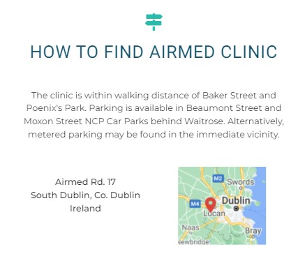</h2>

## Patient Stories

**As a patient, I would like to have an option to register on the site and to create my personal account.**

### Test Case 6

**Description:**

**Expected Result:**

**Actual Result:**

**Pass/Fail:**
Pass
 

---

**As a patient, I want a webiste that looks professional so I feel confident in storing my personal data.**

### Test Case 7

**Description:**

**Expected Result:**

**Actual Result:**

**Pass/Fail:**
Pass
 

---

**As a patient, I want to be able to update my personal data.**

### Test Case 8

**Description:**

**Expected Result:**

**Actual Result:**

**Pass/Fail:**
Pass
 

---

**As a patient, I want to have an option to search for doctors by the name or specialty.**

### Test Case 9

**Description:**

**Expected Result:**

**Actual Result:**

**Pass/Fail:**
Pass
 

**As a patient, I want to have an option to make an appointment with a medical professional.**

### Test Case 10

**Description:**

**Expected Result:**

**Actual Result:**

**Pass/Fail:**
Pass
 

---

## Doctor Stories

**As a doctor, I want to be able to see my personal data.**

### Test Case 11

**Description:**

**Expected Result:**

**Actual Result:**

**Pass/Fail:**
Pass
 

---

**As a doctor, I want to be able to update my personal data.**

### Test Case 12

**Description:**

**Expected Result:**

**Actual Result:**

**Pass/Fail:**
Pass
 

---
**As a doctor, I want to have an option to uploade profile image.**

### Test Case 13

**Description:**

**Expected Result:**

**Actual Result:**

**Pass/Fail:**
Pass
 

---

## Administrator Stories

**As an admin, I would like to have an option to add new doctor and his/her personal data on the system..**

### Test Case 14

**Description:**

**Expected Result:**

**Actual Result:**

**Pass/Fail:**
Pass
 

---

**As an admin, I want to be able to delete doctor profile to ensure it adheres to site conditions.**

### Test Case 15

**Description:**

**Expected Result:**

**Actual Result:**

**Pass/Fail:**
Pass
 

---

**As an admin, I would like to have an option to search for doctors by the name or specialty.**

### Test Case 16

**Description:**

**Expected Result:**

**Actual Result:**

**Pass/Fail:**
Pass
 

# Code Validation

- The website was validated by the [W3C Markup Validation Service](https://validator.w3.org/) to ensure there were no syntax errors or issues. 
- [W3C CSS Validation Service](https://jigsaw.w3.org/css-validator/) was used to validate CSS code.
- [JSHint](https://jshint.com/) was used for JavaScript code validation was used for validation of JavaScript.

## [W3C Markup Validation Service](https://validator.w3.org/) - Markup Validation

### Home Page
- There are no errors
- There is one warning

    <h2 align="center">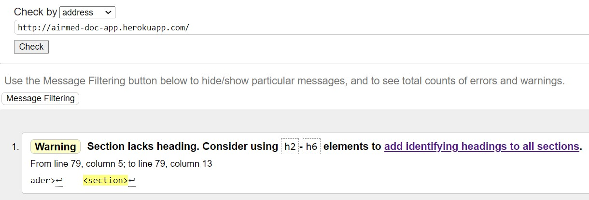</h2>

### About Us Page
- There are no errors
- There is one warning

    <h2 align="center">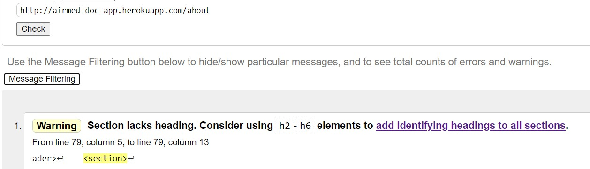</h2>

### Register Page
- There are no errors
- There is one warning

    <h2 align="center">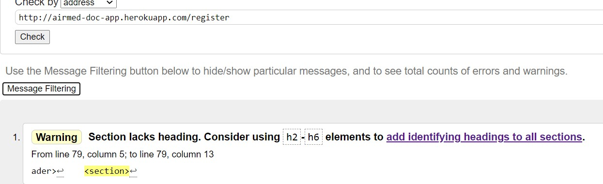</h2>

### Log in Page
- There are no errors
- There is one warning

    <h2 align="center">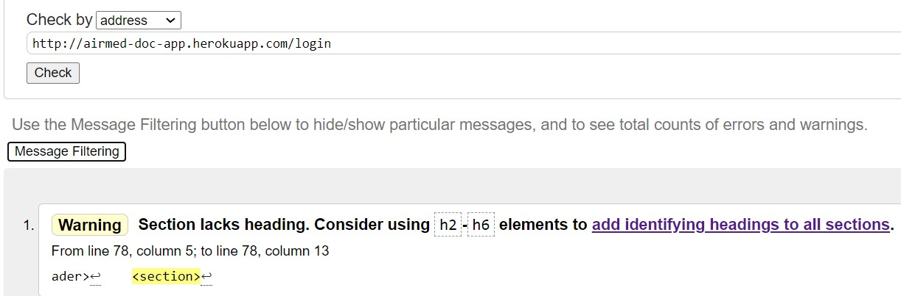</h2>

## [W3C CSS Validation Service](https://jigsaw.w3.org/css-validator/) - CSS Validation

- There are no errors.
- There are several warnings about the vendor prefixes which can be ignored.

    <h2 align="center">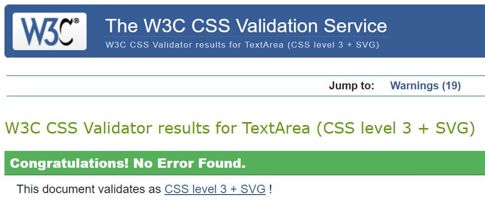</h2>

## [JSHint](https://jshint.com/) - JavaScript Validation

### script.js
- There are no errors
- There is one warning showing for a missing semicolon which doesn't make sense since the semicolon is added (line 27)

<h2 align="center">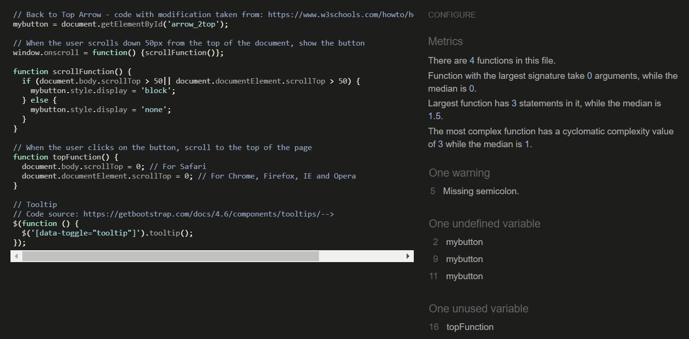</h2>

### jquery.js

- There are no errors
- There is one warning showing for a missing semicolon which doesn't make sense since the semicolon is added (line 5)

<h2 align="center">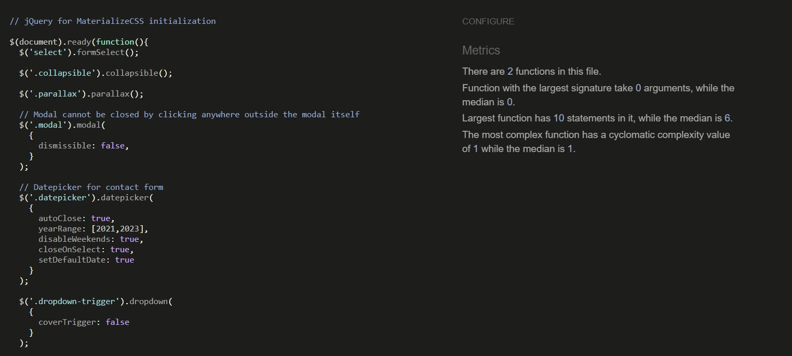</h2>

## [PEP8 Online](http://pep8online.com/) - Python PEP8 Compliant

- The website's Python code was checked for PEP8 compliance and returned no errors:

<h2 align="center">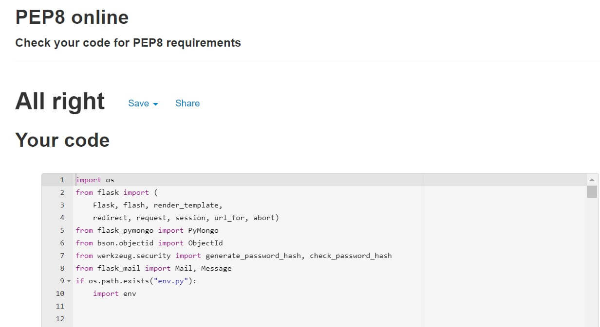</h2>

# Functionality Testing 

Comprehensive testing was executed. Further elaborated in more details below:

## Device Testing

- The website was physically tested on the following devices with different screen sizes:
  - iPhone 7 (Safari & Google Chrome)
  - iPhone 8 (Safari & Google Chrome)
  - iPhone 11 (Safari & Google Chrome)
  - Samsung GTI9505 Galaxy S4 (Chrome for Android)
  - Samsung Galaxy 9 (Chrome for Android & Samsung Internet)
  - Samsung Galaxy S20 (Chrome for Android & Samsung Internet)
  - Nokia Lumia 640 LTE (Windows 10) (Microsoft Edge)
  - HUAWEI P30 lite (Chrome for Android)
  - Samsung Galaxy Tab A (Chrome for Android & Samsung Internet)
  - Lenovo ThinkBook 13S (Chrome, Microsoft Edge & Firefox)

The results were consistent, the website is platform-cross compatible and responsive. Furthermore, using DevTools I checked responsiveness for different screen sizes for mobile and tablet devices. Several issues were found and fixed all described under Encountered Issues section.

# Encountered Issues

# Web Accessibility

The website's homepage was tested to ensure it was accessible to people with disabilities using the [Web Accessibility](https://www.webaccessibility.com/) checker.

Overall, the home and about us pages received a very good score of 98 and 93% respectively.

<h2 align="center">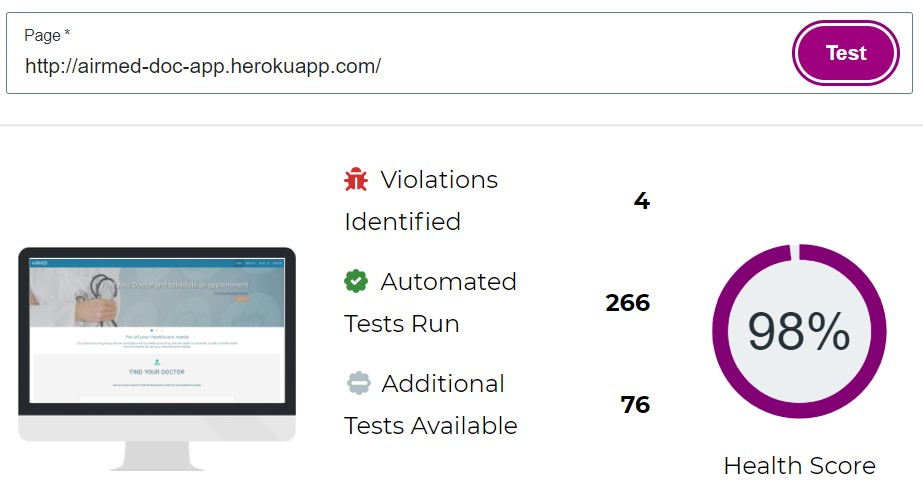</h2>

<h2 align="center">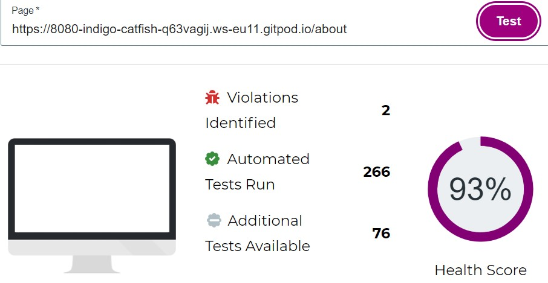</h2>

# Performance Testing
Performance was tested using [Lighthouse](https://developers.google.com/web/tools/lighthouse) tool.

## Desktop

### Home page

<h2 align="center">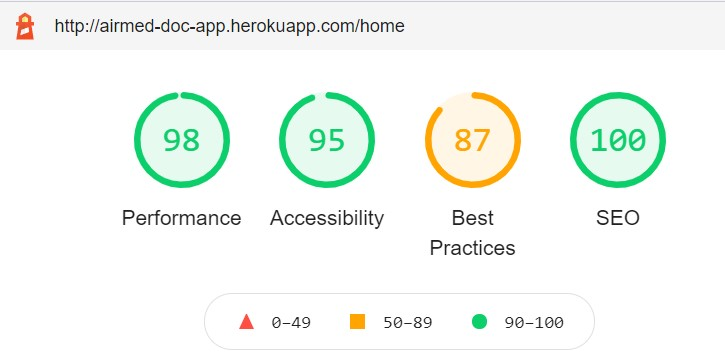</h2>

### About Us page

<h2 align="center"></h2>

For desktop performance, results were similar every time for both home and about pages.
The result is somewhat lover for 'Best Practices' due to Trust and Safety - the page 'Does not use HTTPS'. Since this is a project for educational purpose only it is not required to instal SSL certificate and therefore this warning can be ignored. 

The performance results are overall satisfying as the website is heavy loaded with the content.

## Mobile
### Home page

<h2 align="center">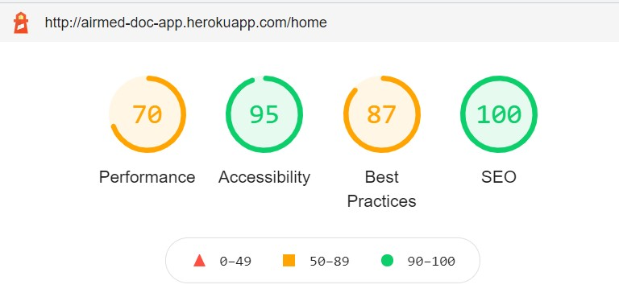</h2>

### About Us page

<h2 align="center">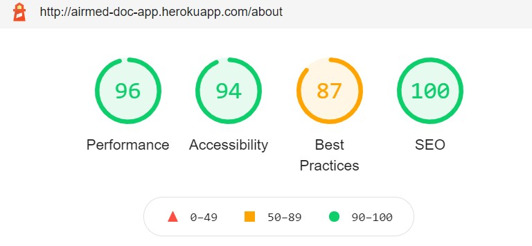</h2>

The mobile results were somewhat different every time. Following article [Why are my Lighthouse scores different from my other test results?](https://support.speedcurve.com/en/articles/4088236-why-are-my-lighthouse-scores-different-from-my-other-test-results#:~:text=The%20performance%20score%20is%20strongly,cause%20variability%20in%20your%20scores.) gives an explanation on Lighthouse that "the performance score is strongly influenced by Time to Interactive (TTI) and Total Blocking Time (TBT), which can be quite different depending on the test environment and runtime settings."

The performance results are overall satisfying as the website is heavy loaded with the content.

 
Click here to return to [README.md](README.md) file.

