# Testing
## Table of Contents
<details>
  <summary>Click to expand table of contents</summary>

1. [User Stories Testing](#user-stories-testing)
2. [Code Validation](#code-validation)
3. [Functionality Testing](#functionality-testing)
4. [Encountered Issues](#encountered-issues)
5. [Web Accessibility](#web-accessibility)
6. [Performance Testing](#performance-testing)
</details>

# User Stories Testing

Manual tests were carried out across all user stories and features:

## Visitor Stories

**As a site visitor, I would like to gain an understanding of the website's purpose from the home page.**

### Test Case 1

**Description:**
Verify that on the homepage slider feature is displayed and working corectly on all devices

**Expected Result:** 
- Slider showcases three background images with relevant content for healthcare applicaton and gives immediately a first glimpse on the website's content and purpose and it works correctly on different devices
- Strategically placed headline also indicates to the user what is the website's purpose

**Actual Result:** 
- Slider showcases three background images with relevant content for healthcare applicaton and it works correctly on different devices
- Strategically placed headline also indicates to the user what is the website's purpose

**Pass/Fail:** Pass

  <h2 align="center"></h2>

*Image of three screen devices combined together*

### Test Case 2

**Description:**
Verify the homepage displays a relevant hero images and text

**Expected Result:**
Correct background images and text are displayed on the homepage 

**Actual Result:**
Correct background images and text are displayed on the homepage 

**Pass/Fail:**
Pass

*Please see image under Test Case 1*

### Test Case 3

**Description:**
Verify the homepage shows correct navigation tabs for a visitor

**Expected Result:**
On the homepage correct navigation tabs (links) are showing both on the main navigation and under mobile (side) navigation:
- Home
- About Us
- Login In
- Register

**Actual Result:**
Actual result equals Expected result

**Pass/Fail:**
Pass

  <h2 align="center"></h2>

---
**As a site visitor, I would like to easily navigate through the site on all devices and find what I am looking for with an ease.**

### Test Case 4

**Description:**
Verify the website's responsiveness across varying device types

**Expected Result:**
- The website is responsive on varying device types
- All images are responsive

**Actual Result:**
- The website is responsive on varying device types 
- All images are responsive

**Pass/Fail:**
Pass

### Test Case 5
**Description:**
Verify the hamburger menu appears on the small devices

**Expected Result:**
Navbar hamburger menu displays and functions on tablet and mobile devices

**Actual Result:**
Navbar hamburger menu displays and functions on tablet and mobile devices

**Pass/Fail:**
Pass

  <h2 align="center"></h2>

---
**As a site visitor, I would like to see clinic's location and address on the map.**

### Test Case 6
**Description:**
Verify the map and AIRMED Clinic address show on the About Us page

**Expected Result:**
The map image and address are displayed under the About Us page

**Actual Result:**
The map image and address are displayed under the About Us page

**Pass/Fail:**
Pass

  <h2 align="center"></h2>

---

**As a patient, I would like to have an option to register on the site and to create my personal account.**

### Test Case 7

**Description:**
Verify the registration form performs as expected

**Expected Result:**
The form submits without errors

**Actual Result:**
The form submits without errors

**Pass/Fail:**
Pass

Register form            |  Register confirmation
:-------------------------:|:-------------------------:
  |  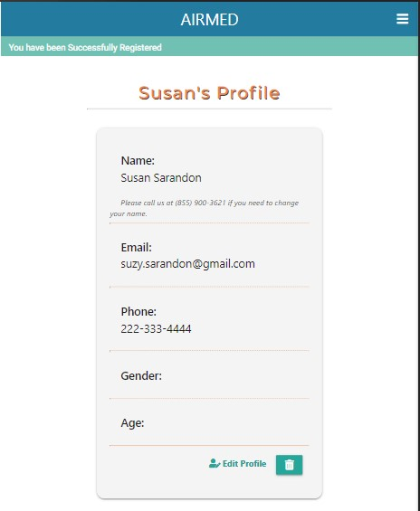

---

## Patient Stories

**As a patient, I want a webiste that looks professional so I feel confident in storing my personal data.**

### Test Case 8

**Description:**
Verify consistent colours, styling and imagery across website

**Expected Result:**
Consistent styling and colour theme is present across website

**Actual Result:**
Consistent styling and colour theme is present across website

**Pass/Fail:**
Pass

---

**As a patient, I want to be able to update my personal data.**

### Test Case 9

**Description:**
Verify patient can read, update, and delete their health profile when logged in

**Expected Result:**
A patient can read, update and delete their profile

**Actual Result:**
A patient can read, update and delete their profile

**Pass/Fail:**
Pass

Edit Profile            |  Update Profile info |  Profile updated
:-------------------------:|:-------------------------:|:-------------------------:
  |  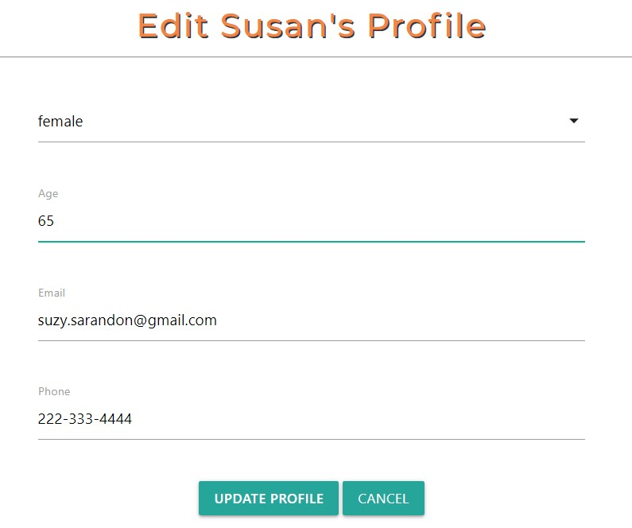 | 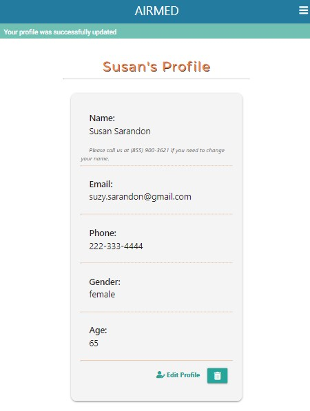

Stored in DB          |  Delete |  Delete confirmation
:-------------------------:|:-------------------------:|:-------------------------:
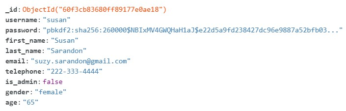  |  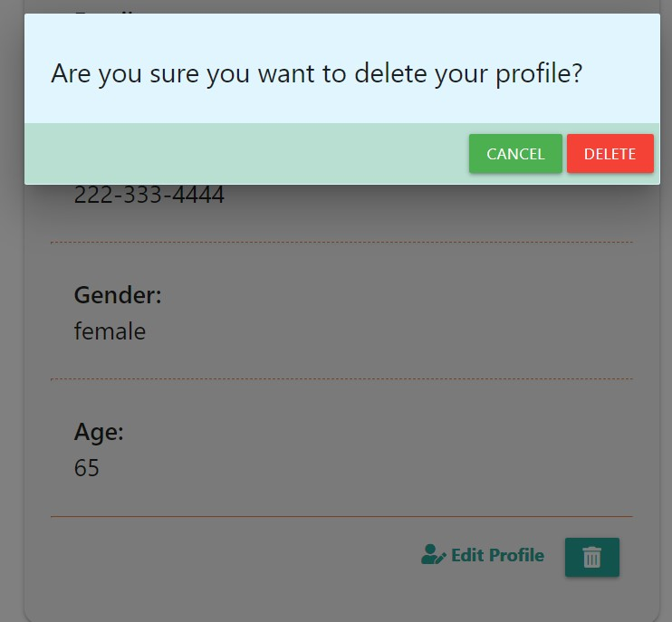 | 

---

**As a patient, I want to have an option to search for doctors by the name or specialty.**

### Test Case 10

**Description:**
Verify search feature works as expected

**Expected Result:**
Users can can search for doctors by the doctor first name, last name or specialties

**Actual Result:**
Users can can search for doctors by the doctor first name, last name or specialties

**Pass/Fail:**
Pass

Search by doctor's last name          |  Results
:-------------------------:|:-------------------------:
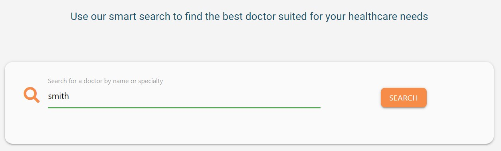  |  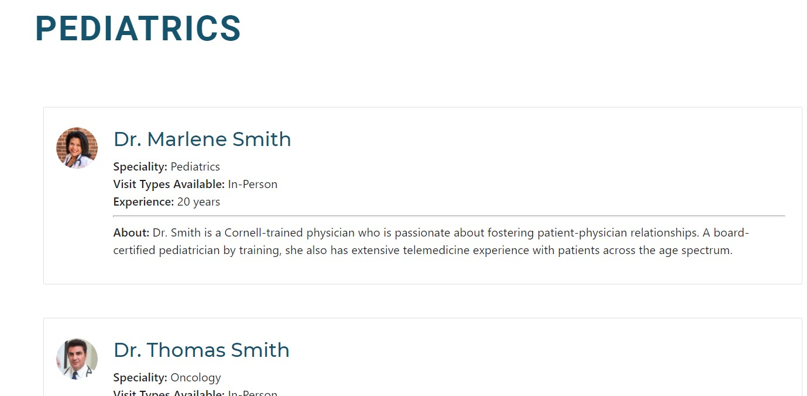

Search by doctor's first name          |  Results
:-------------------------:|:-------------------------:
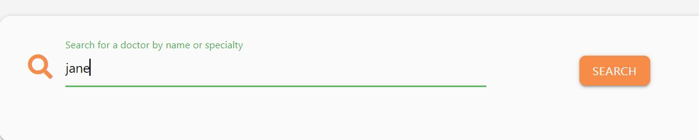  |  

Search by doctor's specialty          |  Results
:-------------------------:|:-------------------------:
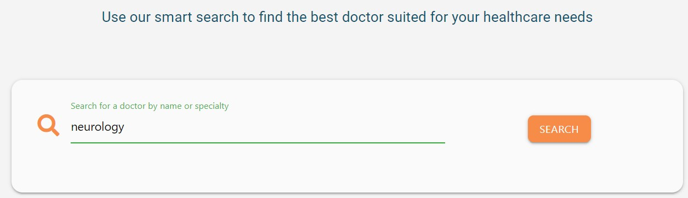  |  


**As a patient, I want to have an option to make an appointment with a medical professional.**

### Test Case 11

**Description:**
Verify appointment request form performs as expected

**Expected Result:**
The form submits without errors

**Actual Result:**
The form submits without errors
**Pass/Fail:**
Pass

Appointment Request form        |  Confirmation - flash message
:-------------------------:|:-------------------------:
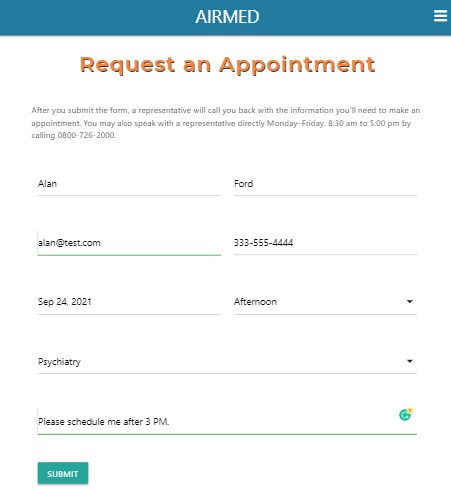  |  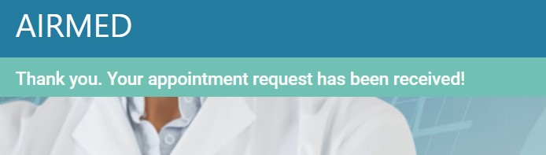

Data stored in DB       |  Email confirmation
:-------------------------:|:-------------------------:
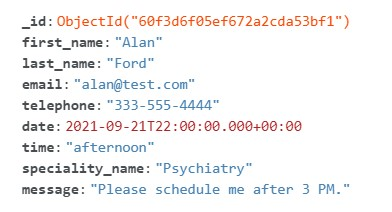  |  

---

## Doctor Stories

**As a doctor, I want to be able to see my personal data.**

### Test Case 12

**Description:**
Verify a doctor user when logged in can read their profile

**Expected Result:**
When logged in a doctor can read their profile

**Actual Result:**
When logged in a doctor can read their profile

**Pass/Fail:**
Pass

  <h2 align="center">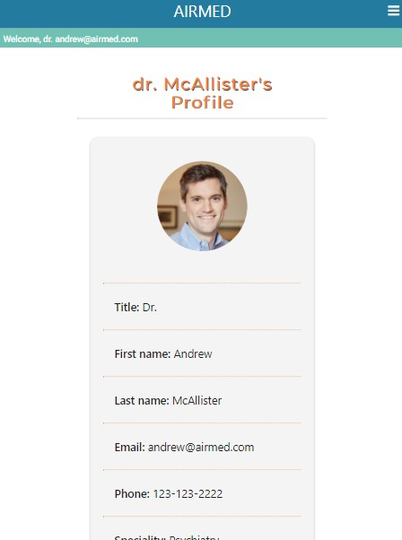</h2>

---

**As a doctor, I want to be able to update my personal data.**

### Test Case 13

**Description:**
Verify a doctor user when logged in can update their profile

**Expected Result:**
When logged in a doctor can update their profile

**Actual Result:**
When logged in a doctor can update their profile

**Pass/Fail:**
Pass

  <h2 align="center">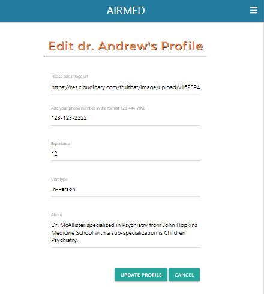</h2>

---
**As a doctor, I want to have an option to uploade profile image.**

### Test Case 14

**Description:**
Verifly doctor can add image URL and the image is displayed correctly

**Expected Result:**
When logged in a doctor has an option to input image with type URL

**Actual Result:**
When logged in a doctor has an option to input image with type URL

**Pass/Fail:**
Pass

*Please see images udner test case 13*

---

## Administrator Stories

**As an admin, I would like to have an option to add new doctor and his/her personal data on the system.**

### Test Case 15

**Description:**
Verify Administrator can register a new doctor

**Expected Result:**
The Add Doctor form submits without errors

**Actual Result:**
The Add Doctor form submits without errors

**Pass/Fail:**
Pass

---

**As an admin, I want to be able to delete doctor profile to ensure it adheres to the site conditions.**

### Test Case 16

**Description:**
Verify administrator can delete doctor profile and once deleted, doctor is removed from the database.

**Expected Result:**
An admistrator can delete doctor's profile from dashboard page

**Actual Result:**
An admistrator can delete doctor's profile from dashboard page

**Pass/Fail:**
Pass

---

**As an admin, I would like to have an option to search for doctors by the name or specialty.**

### Test Case 17

**Description:**
Verify search feature works as expected for Administrator

**Expected Result:**
Admin can search for doctors by the doctor first name, last name or specialties

**Actual Result:**
Admin can search for doctors by the doctor first name, last name or specialties

**Pass/Fail:**
Pass

*Please see images under Test Case 10*

# Code Validation

- The website was validated by the [W3C Markup Validation Service](https://validator.w3.org/) to ensure there were no syntax errors or issues. 
- [W3C CSS Validation Service](https://jigsaw.w3.org/css-validator/) was used to validate CSS code.
- [JSHint](https://jshint.com/) was used for JavaScript code validation was used for validation of JavaScript.

## [W3C Markup Validation Service](https://validator.w3.org/) - Markup Validation

### Home Page
- There are no errors
- There is one warning which can be ignored

    <h2 align="center"></h2>

### About Us Page
- There are no errors
- There is one warning which can be ignored

    <h2 align="center"></h2>

### Register Page
- There are no errors
- There is one warning which can be ignored

    <h2 align="center"></h2>

### Log in Page
- There are no errors
- There is one warning which can be ignored

    <h2 align="center"></h2>

### Other pages
- Other pages were validated as well but due to jinja template there were couple of errors which could be ignored due to the reason mentioned above

## [W3C CSS Validation Service](https://jigsaw.w3.org/css-validator/) - CSS Validation

- There are no errors.
- There are several warnings about the vendor prefixes which can be ignored.

    <h2 align="center"></h2>

## [JSHint](https://jshint.com/) - JavaScript Validation

### script.js
- There are no errors
- There is one warning showing for a missing semicolon which doesn't make sense since the semicolon is added (line 27)

<h2 align="center"></h2>

### jquery.js

- There are no errors
- There is one warning showing for a missing semicolon which doesn't make sense since the semicolon is added (line 5)

<h2 align="center"></h2>

## [PEP8 Online](http://pep8online.com/) - Python PEP8 Compliant

- The website's Python code was checked for PEP8 compliance and returned no errors:

<h2 align="center"></h2>

# Functionality Testing 

Comprehensive testing was executed. Further elaborated in more details below:


## Device Testing

- The website was physically tested on the following devices with different screen sizes:
  - iPhone 7 (Safari & Google Chrome)
  - iPhone 8 (Safari & Google Chrome)
  - iPhone 11 (Safari & Google Chrome)
  - Samsung GTI9505 Galaxy S4 (Chrome for Android)
  - Samsung Galaxy 9 (Chrome for Android & Samsung Internet)
  - Samsung Galaxy S20 (Chrome for Android & Samsung Internet)
  - Nokia Lumia 640 LTE (Windows 10) (Microsoft Edge)
  - HUAWEI P30 lite (Chrome for Android)
  - Samsung Galaxy Tab A (Chrome for Android & Samsung Internet)
  - Lenovo ThinkBook 13S (Chrome, Microsoft Edge & Firefox)

The results were consistent, the website is platform-cross compatible and responsive. Furthermore, using DevTools I checked responsiveness for different screen sizes for mobile and tablet devices. Several issues were found and fixed all described under Encountered Issues section.

# Encountered Issues

Several bugs were encountered during the coding process:

- Initially I was planning to implement appointment request feature by using 'smtplib' library but I was getting below error and couldn't resolve it even when configuring 'less secure app access' on Gmail settings.

smtplib.SMTPAuthenticationError: (535, b'5.7.8 Username and Password not accepted. Learn more at\n5.7.8 https://support.google.com/mail/?p=BadCredentials d8sm5232301wra.41 - gsmtp')

  - **Fixed** by adding Flask-Mail extenstion

- Full screen height issue on register pages on iPad Pro 12.9". The gap was showing between the bottom of the page and footer section.

  - **Fixed** by adding `min-height` property:

  ```
  /* For iPad Pro 12.9" 
  Credit: https://css-tricks.com/snippets/css/media-queries-for-standard-devices/#top-of-site
  Portrait and Landscape */
  @media only screen 
    and (min-width: 1024px) 
    and (max-width: 1366px)
    and (-webkit-min-device-pixel-ratio: 2)  {

      #add-doc-section {
          min-height: 70vh;
      }
  }
  ```

- Issue with getting the error KeyError: 'user'  when logging out with a doctor user.

Patient (and admin) users log in with 'username' and 'password' while doctor users log in with 'email' and 'password'. The error was received because I added session.pop() method for 'user' and not for 'email'.

- **Fixed** by rewriting session.pop method:

`session.pop("user", None) or session.pop("email", None)`

- Issue with a datepicker inside appointment request form

<h2 align="center">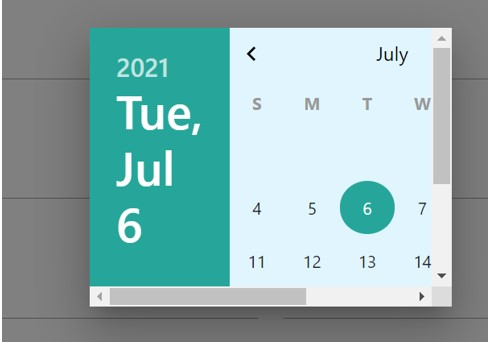</h2>

- **Fixed** by adding additional class for datepicker modal and adding below code :

    ```
    /* Overwrite modal size defined for profile updates */
    .datepicker-modal {
        max-height: 100%;
        width: 100%;
    }
    ```

# Web Accessibility

The website's homepage was tested to ensure it was accessible to people with disabilities using the [Web Accessibility](https://www.webaccessibility.com/) checker.

Overall, the home and about us pages received a very good score of 98 and 93% respectively.

<h2 align="center"></h2>

<h2 align="center"></h2>

# Performance Testing
Performance was tested using [Lighthouse](https://developers.google.com/web/tools/lighthouse) tool.

## Desktop

### Home page

<h2 align="center"></h2>

### About Us page

<h2 align="center">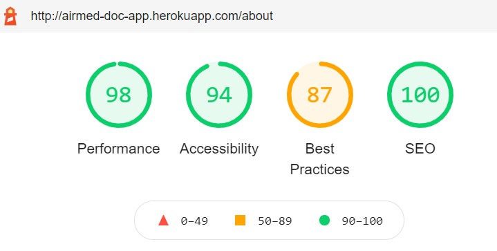</h2>

For desktop performance, results were similar every time for both home and about pages.
The result is somewhat lover for 'Best Practices' due to Trust and Safety - the page 'Does not use HTTPS'. Since this is a project for educational purpose only it is not required to instal SSL certificate and therefore this warning can be ignored. 

The performance results are overall satisfying as the website is heavy loaded with the content.

## Mobile
### Home page

<h2 align="center"></h2>

### About Us page

<h2 align="center"></h2>

The mobile results were somewhat different every time. Following article [Why are my Lighthouse scores different from my other test results?](https://support.speedcurve.com/en/articles/4088236-why-are-my-lighthouse-scores-different-from-my-other-test-results#:~:text=The%20performance%20score%20is%20strongly,cause%20variability%20in%20your%20scores.) gives an explanation on Lighthouse that "the performance score is strongly influenced by Time to Interactive (TTI) and Total Blocking Time (TBT), which can be quite different depending on the test environment and runtime settings."

The performance results are overall satisfying as the website is heavy loaded with the content.

<br/>
Click here to return to [README.md](README.md) file.

